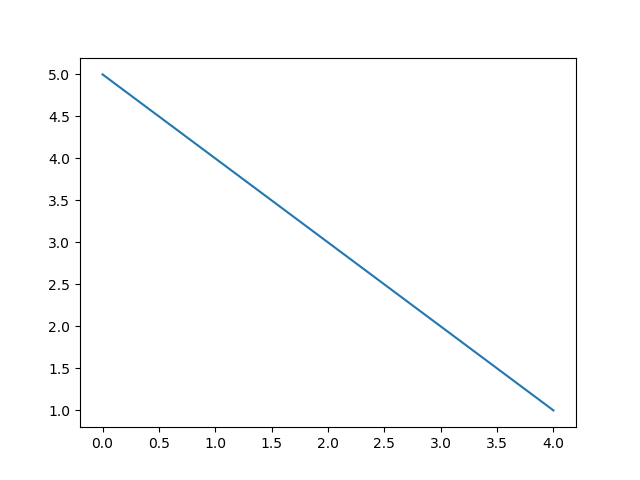

## Readme File for BA Data Science mini project. 
## Used to explore options for embedding images and starting a new project with newly understood best practices. 

We want to show images like this: 

